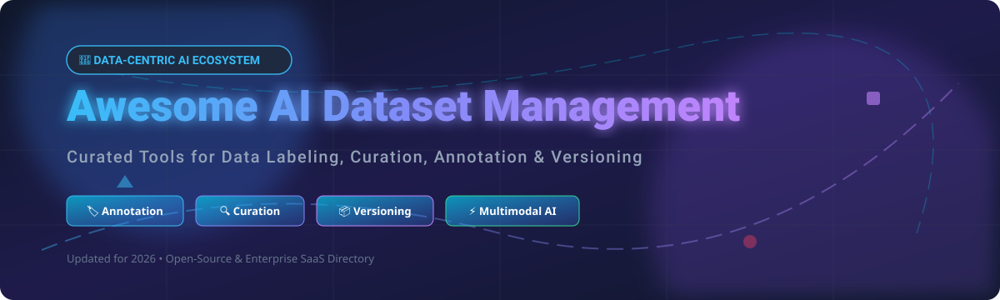

# Awesome AI Dataset Management 🚀

  

## 🌟 Top AI Dataset Management & Data-Centric AI Ecosystem

**A Curated List of SaaS Products & Open-Source GitHub Projects**  
*Focused on Data Labeling, Dataset Curation, Annotation Workflows, Versioning, Active Learning & Data-Centric AI Ops*  

**Last updated: September 2026** 📅

---

This repository tracks notable **SaaS platforms** and **open-source projects** for **AI Dataset Management**. These systems help teams label, curate, version, and quality-check training data—images, video, text, audio, and multimodal datasets—for machine learning (ML), computer vision, natural language processing (NLP), and generative AI (GenAI).

---

## 📑 Table of Contents
- [📊 Market Overview & Industry Dynamics](#-market-overview--industry-dynamics)
- [💼 SaaS/Hosted Platforms](#-saashosted-platforms)
- [🔓 Open-Source GitHub Projects](#-open-source-github-projects)
- [🛠️ Composable Open-Source Stacks](#%EF%B8%8F-composable-open-source-stacks)
- [💖 Support & Sponsorship](#-support--sponsorship)
- [🤝 How to Contribute](#-how-to-contribute)
- [⚠️ Disclaimer](#%EF%B8%8F-disclaimer)
- [📈 Star History](#-star-history)

---

## 📊 Market Overview & Industry Dynamics

> [!NOTE]
> **Market Size & Fragmentation Analysis:**
> The global **AI Data Management & Data Labeling Market** is estimated at **~$4.2 Billion** (as of 2026) and is projected to reach **~$12.8 Billion by 2030** (CAGR ~32%).
> 
> The sector is **moderately fragmented**. While giant infrastructure providers (like Scale AI) capture significant market share in enterprise workforce labeling and RLHF, specialized platforms (Encord, Labelbox, Snorkel AI, V7) dominate niche multimodal, active learning, and programmatic data curation verticals. Open-source solutions (Label Studio, CVAT, FiftyOne) remain hugely dominant for privacy-conscious self-hosted teams.

---

## 💼 SaaS/Hosted Platforms

Below is a curated comparison of leading commercial AI dataset management, annotation, and curation platforms. Sorted by company size / valuation (descending):

| Platform 🏢 | Valuation / Company Size 💰 | Starting Paid Tier 💵 | Free Tier / Trial Limit 🎁 | Key Features & Focus 🎯 |
| :--- | :--- | :--- | :--- | :--- |
| **[Scale AI (Nucleus)](https://scale.com/nucleus)** | **~$29 Billion** (Valuation) / ~$870M+ ARR | $1,500 / month (Team Tier) | **1,000 free labeling units** + 10,000 image index limit | Dataset curation, vector search, error diagnosis & RLHF data engine for frontier AI models. |
| **[Snorkel AI (Snorkel Flow)](https://snorkel.ai/)** | **~$3.5 Billion** (Valuation) / ~$375M ARR | Custom Enterprise (~$25,000/yr starting) | **14-day Enterprise Sandbox trial** (up to 5,000 rows processed) | Programmatic data labeling, weak supervision, and automated dataset creation for LLMs. |
| **[Labelbox](https://labelbox.com/)** | **~$1.0 Billion** (Valuation) / ~$50M+ ARR | $0.10 per LBU (Starter Plan) | **500 free Labelbox Units (LBUs) / month** | Enterprise training data platform, active learning, catalog, and model-assisted labeling. |
| **[Encord](https://encord.com/)** | **~$550 Million** (Valuation) / $110M Raised | $299 / month (Growth Tier) | **14-day free trial** (up to 1,000 files/annotations) | Multimodal AI data platform, micro-annotation, automated quality assurance & DICOM medical imaging. |
| **[Dataloop AI](https://dataloop.ai/)** | **~$175 Million** (Valuation) | $499 / month (Team Plan) | **14-day free trial** (up to 500 MB storage & 2,500 annotations) | End-to-end data engine, enterprise data pipeline automation, human-in-the-loop workflows. |
| **[V7 (V7 Darwin & Go)](https://www.v7labs.com/)** | **~$150 Million** (Valuation) / ~$28M ARR | $149 / month (Pro Starter) | **14-day free trial** (up to 500 items & auto-segmentation credits) | Automated dataset labeling, neural network auto-annotation, dataset management for computer vision. |
| **[SuperAnnotate](https://www.superannotate.com/)** | **~$120 Million** (Valuation) / Series B | Custom Enterprise | **Starter Plan free trial** (1,000 compute hours + basic annotation) | LLM fine-tuning, multimodal dataset curation, workforce management & automated pipeline QA. |
| **[Lightly AI](https://www.lightly.ai/)** | **~$35 Million** (Valuation) | $350 / month (Team Tier) | **Free Plan** (up to 1,000 samples per dataset) | Active learning and data selection platform; selects the most informative samples to reduce labeling costs. |
| **[Activeloop (Deep Lake)](https://www.activeloop.ai/)** | **~$14.4 Million** (Valuation) | $0.05 / GB-month (Cloud Tier) | **Free Community Plan** (up to 10 GB dataset storage) | Database for AI; tensor storage, query, streaming, and versioning for multimodal ML datasets. |

---

## 🔓 Open-Source GitHub Projects

These open-source tools power self-hosted data labeling, dataset curation, and data versioning pipelines. Sorted by GitHub Star Count (descending):

| Repository 📦 | GitHub Stars ⭐ | License 📜 | Category & Primary Focus 🎯 |
| :--- | :--- | :--- | :--- |
| **[Label Studio](https://github.com/HumanSignal/label-studio)** |  | Apache-2.0 | Multimodal data labeling (Image, Audio, Text, Video, Time Series). |
| **[LabelImg](https://github.com/HumanSignal/labelImg)** |  | MIT | Graphical image annotation tool and label bounding boxes (Legacy/Archived). |
| **[DVC (Data Version Control)](https://github.com/iterative/dvc)** |  | Apache-2.0 | Git-like data & ML pipeline version control for datasets & models. |
| **[CVAT (Computer Vision Annotation)](https://github.com/cvat-ai/cvat)** |  | MIT | Enterprise interactive computer vision annotation for video, 3D LiDAR & images. |
| **[FiftyOne (Voxel51)](https://github.com/voxel51/fiftyone)** |  | Apache-2.0 | Open-source tool for building, visualizing, and curating computer vision datasets. |
| **[Doccano](https://github.com/doccano/doccano)** |  | MIT | Open-source text annotation tool for human annotation (NER, sentiment, translation). |
| **[Deep Lake (Activeloop)](https://github.com/activeloopai/deeplake)** |  | Apache-2.0 | AI Data Lake for deep learning; versioning, querying & streaming multimodal datasets. |
| **[AnyLabeling](https://github.com/anylabeling/anylabeling)** |  | GPL-3.0 | Auto-labeling tool integrated with Segment Anything (SAM) & YOLO models. |
| **[Pachyderm](https://github.com/pachyderm/pachyderm)** |  | Apache-2.0 | Data versioning, data lineage, and automated data pipelines on Kubernetes. |
| **[Argilla](https://github.com/argilla-io/argilla)** |  | Apache-2.0 | Open-source curation and feedback platform for LLMs, NLP datasets & RLHF. |
| **[Cleanlab](https://github.com/cleanlab/cleanlab)** |  | AGPL-3.0 | Standard data-centric AI package for finding label errors & dataset noise automatically. |
| **[Labelme](https://github.com/wkentaro/labelme)** |  | GPL-3.0 | Graphical image polygonal annotation tool written in Python. |

---

## 🛠️ Composable Open-Source Stacks

Modern data-centric AI workflows construct modular pipelines using interoperable open-source components:

- **Multimodal Annotation**: [Label Studio](https://github.com/HumanSignal/label-studio) as the default open choice for general modalities.
- **Computer Vision Pipeline**: [CVAT](https://github.com/cvat-ai/cvat) for video & 3D LiDAR annotation ➡️ [FiftyOne](https://github.com/voxel51/fiftyone) for dataset visualization and embedding curation.
- **Data Quality & Hygiene**: [Cleanlab](https://github.com/cleanlab/cleanlab) for detecting mislabeled samples automatically.
- **Dataset Storage & Versioning**: [Deep Lake](https://github.com/activeloopai/deeplake) for tensor streaming or [DVC](https://github.com/iterative/dvc) for Git-native tracking.
- **NLP & LLM RLHF**: [Argilla](https://github.com/argilla-io/argilla) for human preference feedback and instruction dataset tuning.

---

## 💖 Support & Sponsorship

Thank you for exploring this curated list! If you find this resource helpful for your ML pipelines, data annotation workflows, or research:

- ⭐ **Star** this repository to show your support and help others discover it.
- 🍴 **Fork** it to keep a copy or contribute new entries.
- 📢 **Share** it with your fellow ML engineers, data scientists, and AI builders!
- ☕ **Buy me a coffee**: If you'd like to support ongoing updates and maintenance of awesome lists, consider becoming a sponsor via the [GitHub Sponsor Dashboard](https://github.com/sponsors/ishandutta2007).

---

## 🤝 How to Contribute

Contributions are welcome! Please follow these simple guidelines:

1. 🍴 **Fork** the repository.
2. 📝 **Add/Edit** entries in `README.md` following the standard table formatting.
3. ℹ️ Include: Name, Link, License/Pricing, and accurate specifications.
4. 🚀 **Submit a Pull Request** with a clear explanation of changes.

---

## ⚠️ Disclaimer

- This repository is a **community-curated list** for informational and educational purposes.
- Datasets often contain sensitive or personal information. Maintain proper regulatory compliance (GDPR, HIPAA) when handling raw training data.
- Financial estimations, valuations, and star counts are collected from public market data and snapshots updated as of 2026.

---

## 📈 Star History

---

**Made with ❤️ for ML engineers, data ops teams, and builders practicing Data-Centric AI.**
